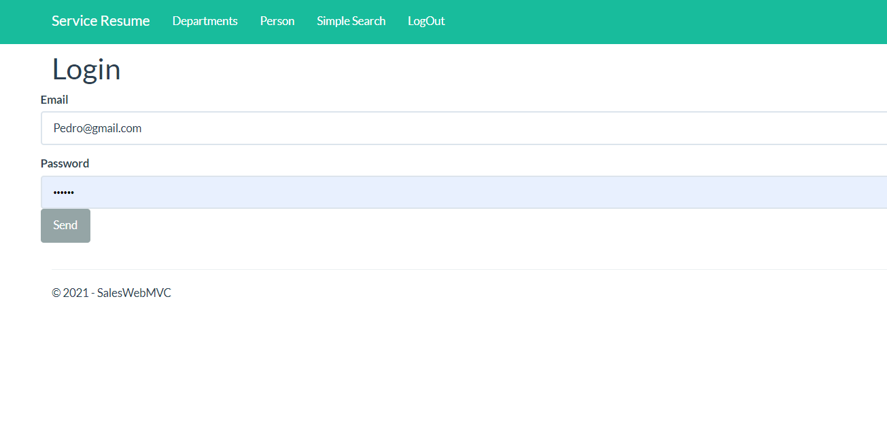
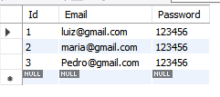
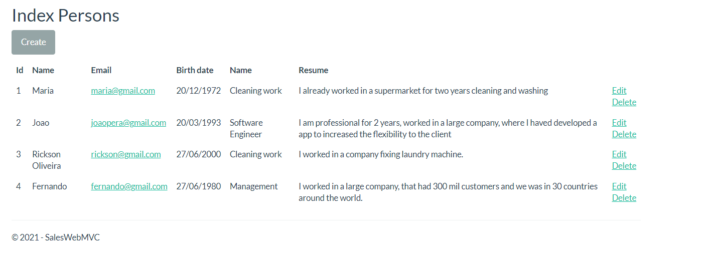
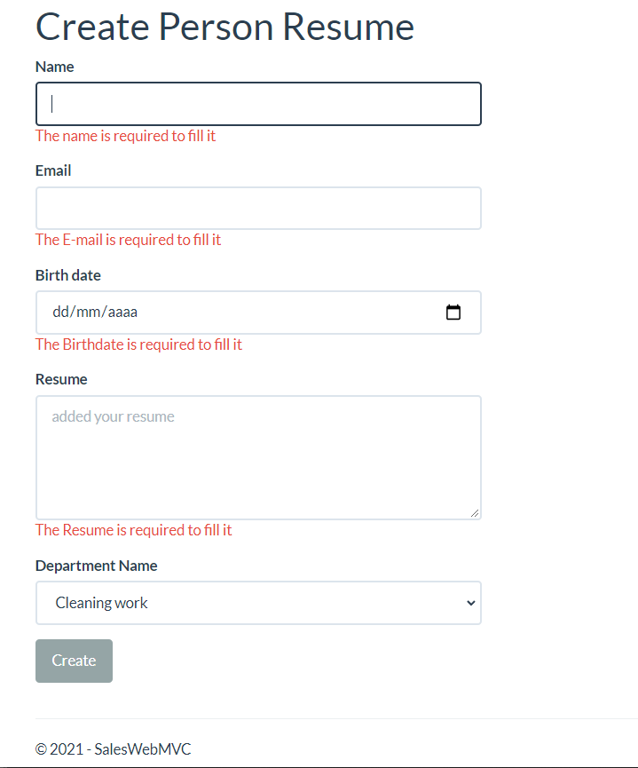
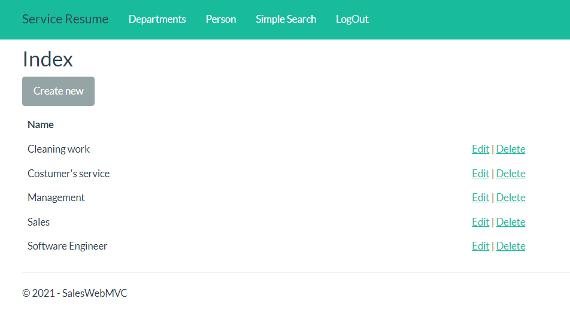
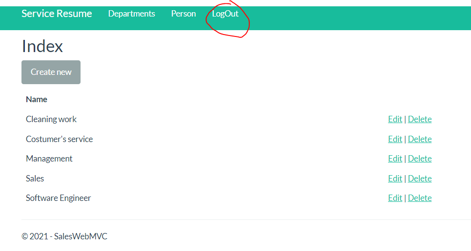

<h1> ## ASPNET MVC 5 curriculum registration project </h1>

<h3>Description English</h3>
<p>
    This project aims to create a basic system for Registering Curriculums and Departments, using CRUD as a basis. In order to guarantee data security and privacy, a Basic Login will be implemented, with employees previously registered in the database. Only logged-in users will have access to the curriculum registration system, thus ensuring the security of stored data. The system will allow the registration, updating and deletion of information referring to curriculum and departments, facilitating the management of human resources of companies and organizations.
    </p>
<h3>Descrição em Português </h3>
<p>Este projeto tem como objetivo a criação de um sistema básico de Cadastro de Currículos e Departamentos, utilizando o CRUD como base. A fim de garantir a segurança e a privacidade dos dados, será implementado um Login Básico, com funcionários já cadastrados previamente no banco de dados. Somente os usuários logados terão acesso ao sistema de cadastro de currículos, garantindo assim a segurança dos dados armazenados. O sistema permitirá o cadastro, atualização e exclusão de informações referentes a currículos e departamentos, facilitando a gestão de recursos humanos de empresas e organizações. </p>

<br />
<br />
serviços utilizadas:
CRUD Scaffolding</br>
MySQL adaptation and migration</br>
Validation</br>
Asynchronous operations using Tasks (async, await)</br>
One to Many Relation Database
</br>
</br>


## 🖼 Screenshot das telas da aplicação <br/>
<p>Tela de Login</p>
<br/>
<br/>
<p>Funcionarios permitidos para Login</p>
<br/>
<br/>
<p>Lista de Curriculos</p>
<br/>
<br/>
<p>formulario Cadastro de Curriculos Usando Validação
E também selecionando todos Departmentos Registrado no Banco
Atualiza Assincrono</p>
<br/>
<br/>
<p>Departmentos Disponiveis (CRUD)</p>
<br/>
<br/>
<p>Opção para Deslogar, se caso clicar em deslogar precisaria logan Novamente, 
e a navegação fica restrição apenas para Login, é ainda sem possibilidade de Acessar pela URL</p>
<br/>
<br/>


<br/>
## 🚀 Tecnologias utilizadas <br/>
<br/>


- C#  asp net<br/>
- Mysql <br/>
- html e css e um pouco de Javascript <br/>
- Razor <br/>
- entity Framework (ORM)<br/>
- Bootstrap
<br/>

## 🚀 Como usar <br/>

```bash
# no arquivo Startup, na linha:
     options.UseMySql("Server = localhost; Database = Resume; Uid = root; Pwd = Futebol#366;"));
     terá que mudar para o Servidor do seu mysql ";
# Entrar numa IDE de sua preferência 


```


## Linkedin abaixo

<h4 align="center">
   Feito com Por   <a href="https://www.linkedin.com/in/luiz-carlos-b50693173/" target="_blank"> Luiz Carlos </a>
</h4>

</html>
